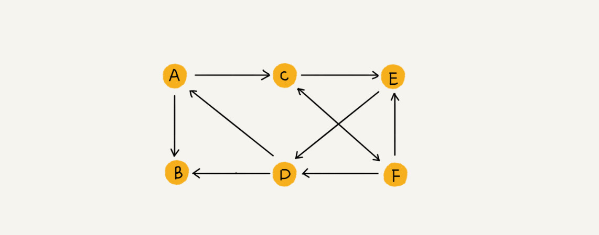
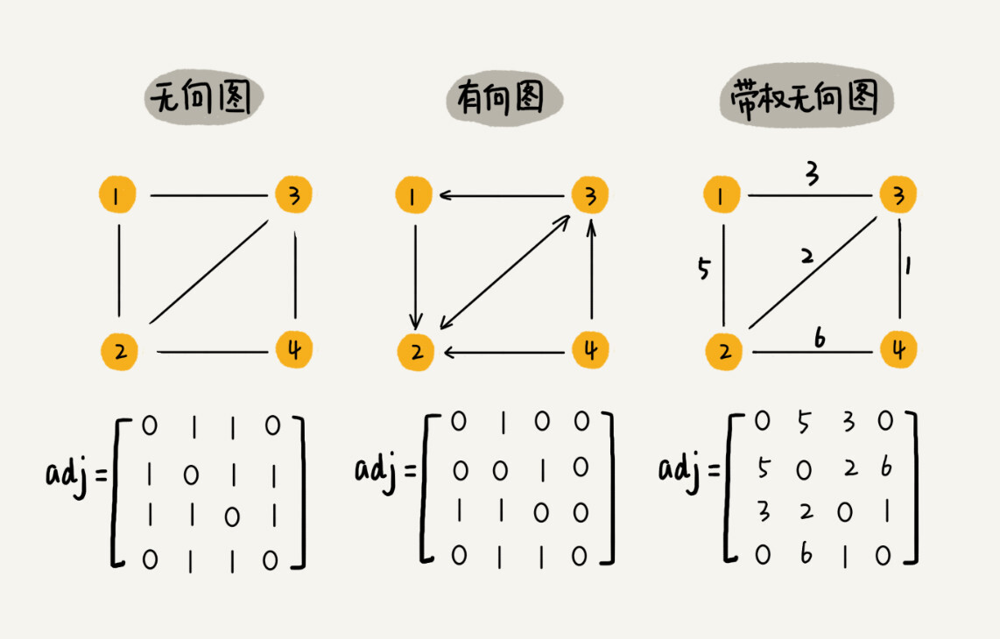
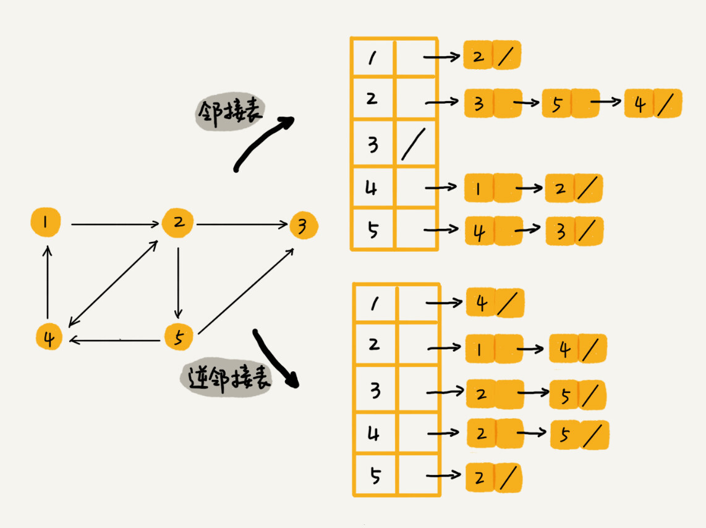
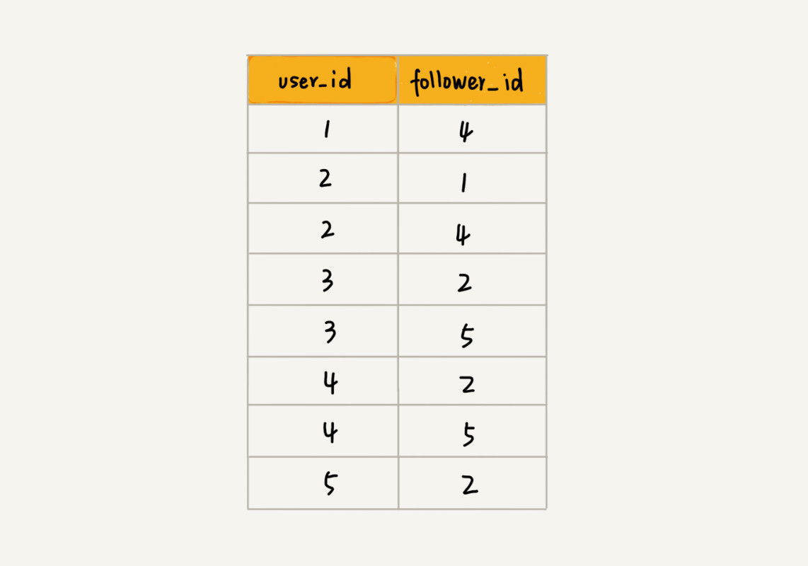

# 30 | 图的表示：如何存储微博、微信等社交网络中的好友关系？
<audio src='./30-图的表示：如何存储微博、微信等社交网络中的好友关系？.mp3' controls></audio>
微博、微信、LinkedIn这些社交软件我想你肯定都玩过吧。在微博中，两个人可以互相关注；在微信中，两个人可以互加好友。那你知道， **如何存储微博、微信等这些社交网络的好友关系吗？**

这就要用到我们今天要讲的这种数据结构：图。实际上，涉及图的算法有很多，也非常复杂，比如图的搜索、最短路径、最小生成树、二分图等等。我们今天聚焦在图存储这一方面，后面会分好几节来依次讲解图相关的算法。

## 如何理解“图”？

我们前面讲过了树这种非线性表数据结构，今天我们要讲另一种非线性表数据结构， **图**（Graph）。和树比起来，这是一种更加复杂的非线性表结构。

我们知道，树中的元素我们称为节点，图中的元素我们就叫做 **顶点**（vertex）。从我画的图中可以看出来，图中的一个顶点可以与任意其他顶点建立连接关系。我们把这种建立的关系叫做 **边**（edge）。

我们生活中就有很多符合图这种结构的例子。比如，开篇问题中讲到的社交网络，就是一个非常典型的图结构。

我们就拿微信举例子吧。我们可以把每个用户看作一个顶点。如果两个用户之间互加好友，那就在两者之间建立一条边。所以，整个微信的好友关系就可以用一张图来表示。其中，每个用户有多少个好友，对应到图中，就叫做顶点的 **度**（degree），就是跟顶点相连接的边的条数。

实际上，微博的社交关系跟微信还有点不一样，或者说更加复杂一点。微博允许单向关注，也就是说，用户A关注了用户B，但用户B可以不关注用户A。那我们如何用图来表示这种单向的社交关系呢？

我们可以把刚刚讲的图结构稍微改造一下，引入边的“方向”的概念。

如果用户A关注了用户B，我们就在图中画一条从A到B的带箭头的边，来表示边的方向。如果用户A和用户B互相关注了，那我们就画一条从A指向B的边，再画一条从B指向A的边。我们把这种边有方向的图叫做“有向图”。以此类推，我们把边没有方向的图就叫做“无向图”。

我们刚刚讲过，无向图中有“度”这个概念，表示一个顶点有多少条边。在有向图中，我们把度分为 **入度**（In-degree）和 **出度**（Out-degree）。

顶点的入度，表示有多少条边指向这个顶点；顶点的出度，表示有多少条边是以这个顶点为起点指向其他顶点。对应到微博的例子，入度就表示有多少粉丝，出度就表示关注了多少人。

前面讲到了微信、微博、无向图、有向图，现在我们再来看另一种社交软件：QQ。

QQ中的社交关系要更复杂一点。不知道你有没有留意过QQ亲密度这样一个功能。QQ不仅记录了用户之间的好友关系，还记录了两个用户之间的亲密度，如果两个用户经常往来，那亲密度就比较高；如果不经常往来，亲密度就比较低。如何在图中记录这种好友关系的亲密度呢？

这里就要用到另一种图， **带权图**（weighted graph）。在带权图中，每条边都有一个权重（weight），我们可以通过这个权重来表示QQ好友间的亲密度。

关于图的概念比较多，我今天也只是介绍了几个常用的，理解起来都不复杂，不知道你都掌握了没有？掌握了图的概念之后，我们再来看下，如何在内存中存储图这种数据结构呢？

## 邻接矩阵存储方法

图最直观的一种存储方法就是， **邻接矩阵**（Adjacency Matrix）。

邻接矩阵的底层依赖一个二维数组。对于无向图来说，如果顶点i与顶点j之间有边，我们就将A\[i\]\[j\]和A\[j\]\[i\]标记为1；对于有向图来说，如果顶点i到顶点j之间，有一条箭头从顶点i指向顶点j的边，那我们就将A\[i\]\[j\]标记为1。同理，如果有一条箭头从顶点j指向顶点i的边，我们就将A\[j\]\[i\]标记为1。对于带权图，数组中就存储相应的权重。

用邻接矩阵来表示一个图，虽然简单、直观，但是比较浪费存储空间。为什么这么说呢？

对于无向图来说，如果A\[i\]\[j\]等于1，那A\[j\]\[i\]也肯定等于1。实际上，我们只需要存储一个就可以了。也就是说，无向图的二维数组中，如果我们将其用对角线划分为上下两部分，那我们只需要利用上面或者下面这样一半的空间就足够了，另外一半白白浪费掉了。

还有，如果我们存储的是 **稀疏图**（Sparse Matrix），也就是说，顶点很多，但每个顶点的边并不多，那邻接矩阵的存储方法就更加浪费空间了。比如微信有好几亿的用户，对应到图上就是好几亿的顶点。但是每个用户的好友并不会很多，一般也就三五百个而已。如果我们用邻接矩阵来存储，那绝大部分的存储空间都被浪费了。

但这也并不是说，邻接矩阵的存储方法就完全没有优点。首先，邻接矩阵的存储方式简单、直接，因为基于数组，所以在获取两个顶点的关系时，就非常高效。其次，用邻接矩阵存储图的另外一个好处是方便计算。这是因为，用邻接矩阵的方式存储图，可以将很多图的运算转换成矩阵之间的运算。比如求解最短路径问题时会提到一个 [Floyd-Warshall算法](https://zh.wikipedia.org/wiki/Floyd-Warshall%E7%AE%97%E6%B3%95)，就是利用矩阵循环相乘若干次得到结果。

## 邻接表存储方法

针对上面邻接矩阵比较浪费内存空间的问题，我们来看另外一种图的存储方法， **邻接表**（Adjacency List）。

我画了一张邻接表的图，你可以先看下。乍一看，邻接表是不是有点像散列表？每个顶点对应一条链表，链表中存储的是与这个顶点相连接的其他顶点。另外我需要说明一下，图中画的是一个有向图的邻接表存储方式，每个顶点对应的链表里面，存储的是指向的顶点。对于无向图来说，也是类似的，不过，每个顶点的链表中存储的，是跟这个顶点有边相连的顶点，你可以自己画下。

还记得我们之前讲过的时间、空间复杂度互换的设计思想吗？邻接矩阵存储起来比较浪费空间，但是使用起来比较节省时间。相反，邻接表存储起来比较节省空间，但是使用起来就比较耗时间。

就像图中的例子，如果我们要确定，是否存在一条从顶点2到顶点4的边，那我们就要遍历顶点2对应的那条链表，看链表中是否存在顶点4。而且，我们前面也讲过，链表的存储方式对缓存不友好。所以，比起邻接矩阵的存储方式，在邻接表中查询两个顶点之间的关系就没那么高效了。

在散列表那几节里，我讲到，在基于链表法解决冲突的散列表中，如果链过长，为了提高查找效率，我们可以将链表换成其他更加高效的数据结构，比如平衡二叉查找树等。我们刚刚也讲到，邻接表长得很像散列。所以，我们也可以将邻接表同散列表一样进行“改进升级”。

我们可以将邻接表中的链表改成平衡二叉查找树。实际开发中，我们可以选择用红黑树。这样，我们就可以更加快速地查找两个顶点之间是否存在边了。当然，这里的二叉查找树可以换成其他动态数据结构，比如跳表、散列表等。除此之外，我们还可以将链表改成有序动态数组，可以通过二分查找的方法来快速定位两个顶点之间否是存在边。

## 解答开篇

有了前面讲的理论知识，现在我们回过头来看开篇的问题，如何存储微博、微信等社交网络中的好友关系？

前面我们分析了，微博、微信是两种“图”，前者是有向图，后者是无向图。在这个问题上，两者的解决思路差不多，所以我只拿微博来讲解。

数据结构是为算法服务的，所以具体选择哪种存储方法，与期望支持的操作有关系。针对微博用户关系，假设我们需要支持下面这样几个操作：

- 判断用户A是否关注了用户B；

- 判断用户A是否是用户B的粉丝；

- 用户A关注用户B；

- 用户A取消关注用户B；

- 根据用户名称的首字母排序，分页获取用户的粉丝列表；

- 根据用户名称的首字母排序，分页获取用户的关注列表。

关于如何存储一个图，前面我们讲到两种主要的存储方法，邻接矩阵和邻接表。因为社交网络是一张稀疏图，使用邻接矩阵存储比较浪费存储空间。所以，这里我们采用邻接表来存储。

不过，用一个邻接表来存储这种有向图是不够的。我们去查找某个用户关注了哪些用户非常容易，但是如果要想知道某个用户都被哪些用户关注了，也就是用户的粉丝列表，是非常困难的。

基于此，我们需要一个逆邻接表。邻接表中存储了用户的关注关系，逆邻接表中存储的是用户的被关注关系。对应到图上，邻接表中，每个顶点的链表中，存储的就是这个顶点指向的顶点，逆邻接表中，每个顶点的链表中，存储的是指向这个顶点的顶点。如果要查找某个用户关注了哪些用户，我们可以在邻接表中查找；如果要查找某个用户被哪些用户关注了，我们从逆邻接表中查找。

基础的邻接表不适合快速判断两个用户之间是否是关注与被关注的关系，所以我们选择改进版本，将邻接表中的链表改为支持快速查找的动态数据结构。选择哪种动态数据结构呢？红黑树、跳表、有序动态数组还是散列表呢？

因为我们需要按照用户名称的首字母排序，分页来获取用户的粉丝列表或者关注列表，用跳表这种结构再合适不过了。这是因为，跳表插入、删除、查找都非常高效，时间复杂度是O(logn)，空间复杂度上稍高，是O(n)。最重要的一点，跳表中存储的数据本来就是有序的了，分页获取粉丝列表或关注列表，就非常高效。

如果对于小规模的数据，比如社交网络中只有几万、几十万个用户，我们可以将整个社交关系存储在内存中，上面的解决思路是没有问题的。但是如果像微博那样有上亿的用户，数据规模太大，我们就无法全部存储在内存中了。这个时候该怎么办呢？

我们可以通过哈希算法等数据分片方式，将邻接表存储在不同的机器上。你可以看下面这幅图，我们在机器1上存储顶点1，2，3的邻接表，在机器2上，存储顶点4，5的邻接表。逆邻接表的处理方式也一样。当要查询顶点与顶点关系的时候，我们就利用同样的哈希算法，先定位顶点所在的机器，然后再在相应的机器上查找。

除此之外，我们还有另外一种解决思路，就是利用外部存储（比如硬盘），因为外部存储的存储空间要比内存会宽裕很多。数据库是我们经常用来持久化存储关系数据的，所以我这里介绍一种数据库的存储方式。

我用下面这张表来存储这样一个图。为了高效地支持前面定义的操作，我们可以在表上建立多个索引，比如第一列、第二列，给这两列都建立索引。

## 内容小结

今天我们学习了图这种非线性表数据结构，关于图，你需要理解这样几个概念：无向图、有向图、带权图、顶点、边、度、入度、出度。除此之外，我们还学习了图的两个主要的存储方式：邻接矩阵和邻接表。

邻接矩阵存储方法的缺点是比较浪费空间，但是优点是查询效率高，而且方便矩阵运算。邻接表存储方法中每个顶点都对应一个链表，存储与其相连接的其他顶点。尽管邻接表的存储方式比较节省存储空间，但链表不方便查找，所以查询效率没有邻接矩阵存储方式高。针对这个问题，邻接表还有改进升级版，即将链表换成更加高效的动态数据结构，比如平衡二叉查找树、跳表、散列表等。

## 课后思考

1. 关于开篇思考题，我们只讲了微博这种有向图的解决思路，那像微信这种无向图，应该怎么存储呢？你可以照着我的思路，自己做一下练习。

2. 除了我今天举的社交网络可以用图来表示之外，符合图这种结构特点的例子还有很多，比如知识图谱（Knowledge Graph）。关于图这种数据结构，你还能想到其他生活或者工作中的例子吗？

欢迎留言和我分享，我会第一时间给你反馈。