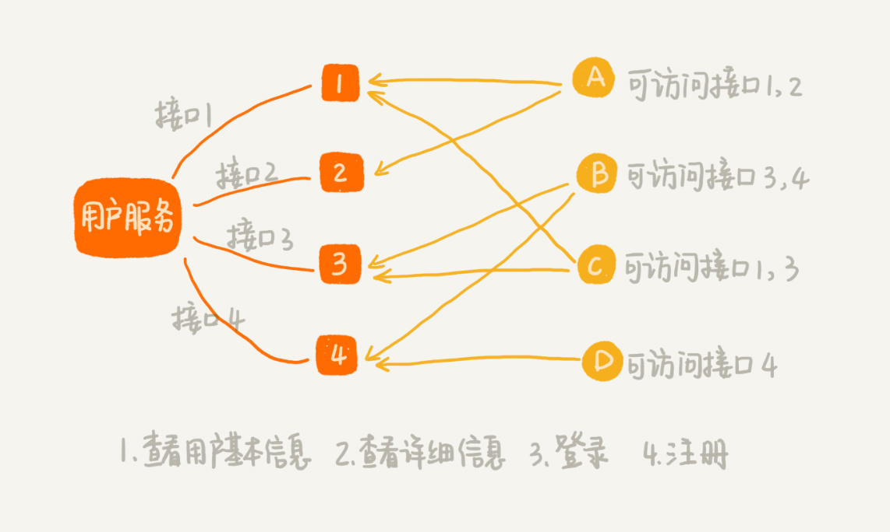
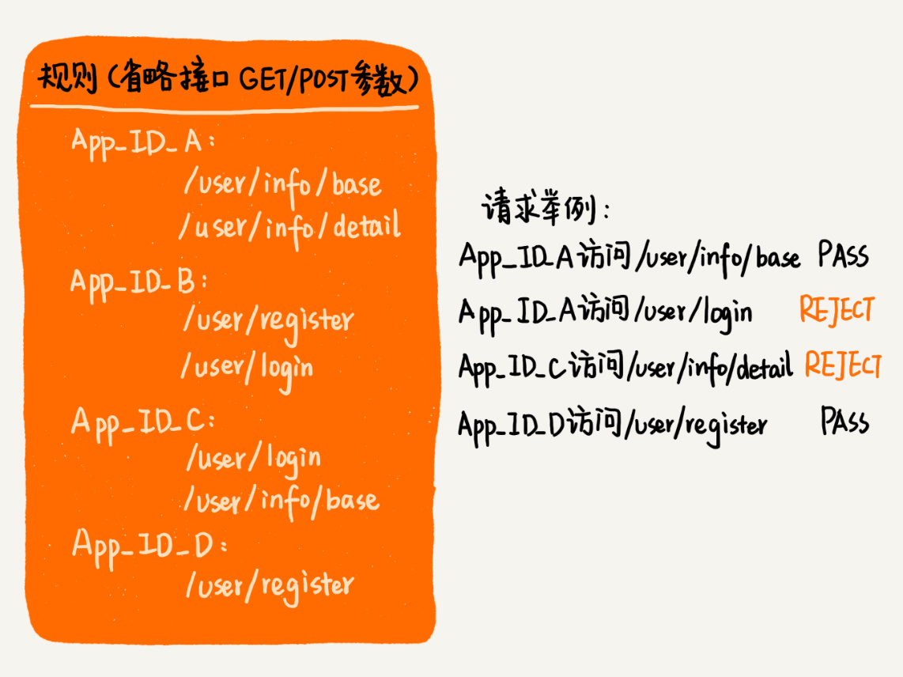
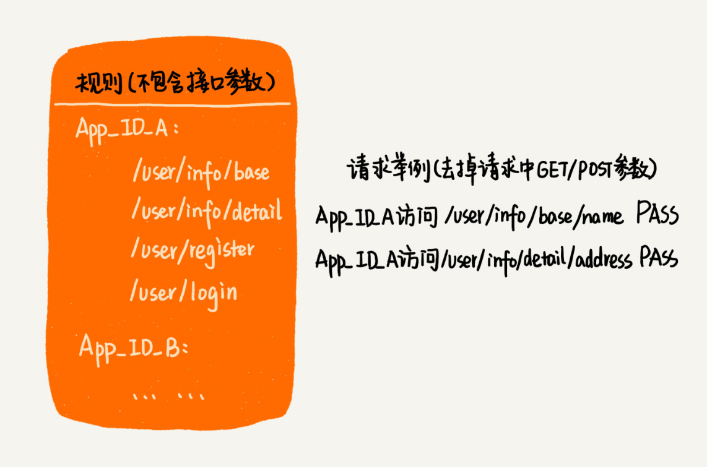
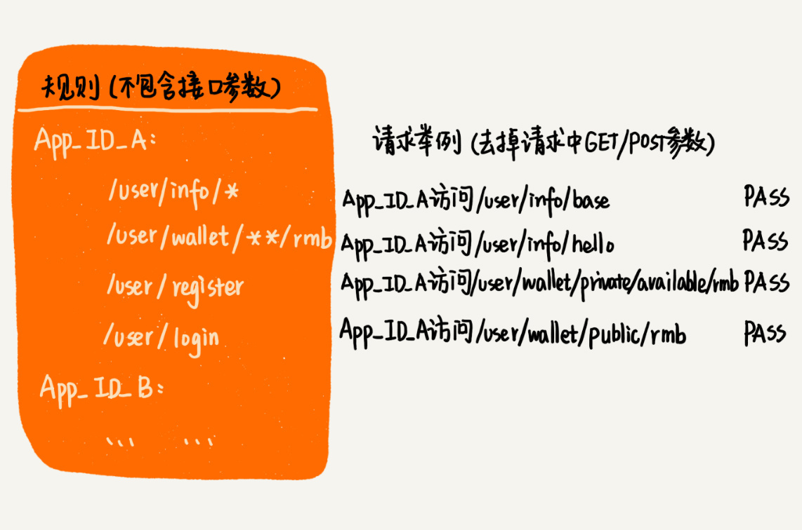
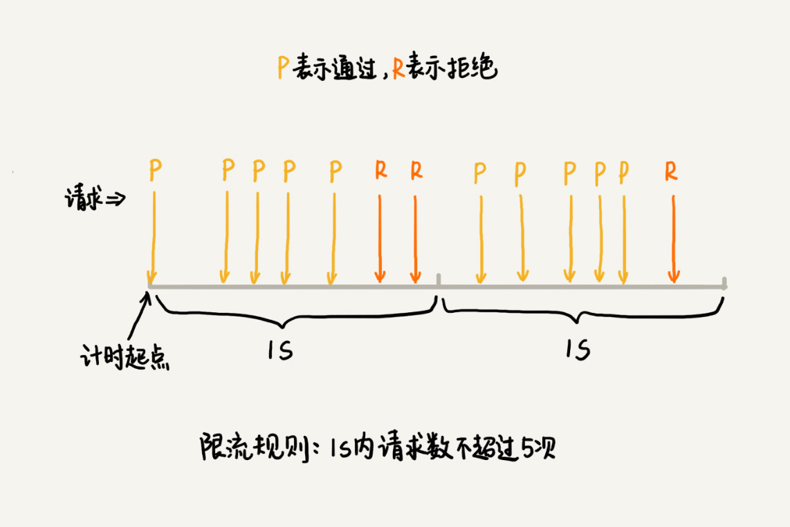
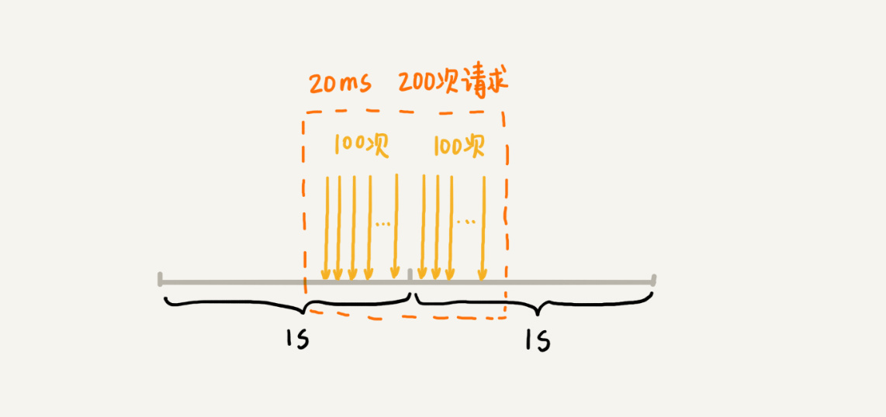

# 55 | 算法实战（四）：剖析微服务接口鉴权限流背后的数据结构和算法
<audio src='./55-算法实战（四）：剖析微服务接口鉴权限流背后的数据结构和算法.mp3' controls></audio>
微服务是最近几年才兴起的概念。简单点讲，就是把复杂的大应用，解耦拆分成几个小的应用。这样做的好处有很多。比如，这样有利于团队组织架构的拆分，毕竟团队越大协作的难度越大；再比如，每个应用都可以独立运维，独立扩容，独立上线，各个应用之间互不影响。不用像原来那样，一个小功能上线，整个大应用都要重新发布。

不过，有利就有弊。大应用拆分成微服务之后，服务之间的调用关系变得更复杂，平台的整体复杂熵升高，出错的概率、debug问题的难度都高了好几个数量级。所以，为了解决这些问题，服务治理便成了微服务的一个技术重点。

所谓服务治理，简单点讲，就是管理微服务，保证平台整体正常、平稳地运行。服务治理涉及的内容比较多，比如鉴权、限流、降级、熔断、监控告警等等。这些服务治理功能的实现，底层依赖大量的数据结构和算法。今天，我就拿其中的鉴权和限流这两个功能，来带你看看，它们的实现过程中都要用到哪些数据结构和算法。

## 鉴权背景介绍

以防你之前可能对微服务没有太多了解，所以我对鉴权的背景做了简化。

假设我们有一个微服务叫用户服务（User Service）。它提供很多用户相关的接口，比如获取用户信息、注册、登录等，给公司内部的其他应用使用。但是，并不是公司内部所有应用，都可以访问这个用户服务，也并不是每个有访问权限的应用，都可以访问用户服务的所有接口。

我举了一个例子给你讲解一下，你可以看我画的这幅图。这里面，只有A、B、C、D四个应用可以访问用户服务，并且，每个应用只能访问用户服务的部分接口。

要实现接口鉴权功能，我们需要事先将应用对接口的访问权限规则设置好。当某个应用访问其中一个接口的时候，我们就可以拿应用的请求URL，在规则中进行匹配。如果匹配成功，就说明允许访问；如果没有可以匹配的规则，那就说明这个应用没有这个接口的访问权限，我们就拒绝服务。

## 如何实现快速鉴权？

接口的格式有很多，有类似Dubbo这样的RPC接口，也有类似Spring Cloud这样的HTTP接口。不同接口的鉴权实现方式是类似的，我这里主要拿HTTP接口给你讲解。

鉴权的原理比较简单、好理解。那具体到实现层面，我们该用什么数据结构来存储规则呢？用户请求URL在规则中快速匹配，又该用什么样的算法呢？

实际上，不同的规则和匹配模式，对应的数据结构和匹配算法也是不一样的。所以，关于这个问题，我继续细化为三个更加详细的需求给你讲解。

### 1.如何实现精确匹配规则？

我们先来看最简单的一种匹配模式。只有当请求URL跟规则中配置的某个接口精确匹配时，这个请求才会被接受、处理。为了方便你理解，我举了一个例子，你可以看一下。

不同的应用对应不同的规则集合。我们可以采用散列表来存储这种对应关系。我这里着重讲下，每个应用对应的规则集合，该如何存储和匹配。

针对这种匹配模式，我们可以将每个应用对应的权限规则，存储在一个字符串数组中。当用户请求到来时，我们拿用户的请求URL，在这个字符串数组中逐一匹配，匹配的算法就是我们之前学过的字符串匹配算法（比如KMP、BM、BF等）。

规则不会经常变动，所以，为了加快匹配速度，我们可以按照字符串的大小给规则排序，把它组织成有序数组这种数据结构。当要查找某个URL能否匹配其中某条规则的时候，我们可以采用二分查找算法，在有序数组中进行匹配。

而二分查找算法的时间复杂度是O(logn)（n表示规则的个数），这比起时间复杂度是O(n)的顺序遍历快了很多。对于规则中接口长度比较长，并且鉴权功能调用量非常大的情况，这种优化方法带来的性能提升还是非常可观的 。

### 2.如何实现前缀匹配规则？

我们再来看一种稍微复杂的匹配模式。只要某条规则可以匹配请求URL的前缀，我们就说这条规则能够跟这个请求URL匹配。同样，为了方便你理解这种匹配模式，我还是举一个例子说明一下。

不同的应用对应不同的规则集合。我们采用散列表来存储这种对应关系。我着重讲一下，每个应用的规则集合，最适合用什么样的数据结构来存储。

在 [Trie树](https://time.geekbang.org/column/article/72414) 那节，我们讲到，Trie树非常适合用来做前缀匹配。所以，针对这个需求，我们可以将每个用户的规则集合，组织成Trie树这种数据结构。

不过，Trie树中的每个节点不是存储单个字符，而是存储接口被“/”分割之后的子目录（比如“/user/name”被分割为“user”“name”两个子目录）。因为规则并不会经常变动，所以，在Trie树中，我们可以把每个节点的子节点们，组织成有序数组这种数据结构。在匹配的过程中，我们可以利用二分查找算法，决定从一个节点应该跳到哪一个子节点。

### 3.如何实现模糊匹配规则？

如果我们的规则更加复杂，规则中包含通配符，比如“\*\*”表示匹配任意多个子目录，“\*”表示匹配任意一个子目录。只要用户请求URL可以跟某条规则模糊匹配，我们就说这条规则适用于这个请求。为了方便你理解，我举一个例子来解释一下。

不同的应用对应不同的规则集合。我们还是采用散列表来存储这种对应关系。这点我们刚才讲过了，这里不再重复说了。我们着重看下，每个用户对应的规则集合，该用什么数据结构来存储？针对这种包含通配符的模糊匹配，我们又该使用什么算法来实现呢？

还记得我们在 [回溯算法](https://time.geekbang.org/column/article/74287) 那节讲的正则表达式的例子吗？我们可以借助正则表达式那个例子的解决思路，来解决这个问题。我们采用回溯算法，拿请求URL跟每条规则逐一进行模糊匹配。如何用回溯算法进行模糊匹配，这部分我就不重复讲了。你如果忘记了，可以回到相应章节复习一下。

不过，这个解决思路的时间复杂度是非常高的。我们需要拿每一个规则，跟请求URL匹配一遍。那有没有办法可以继续优化一下呢？

实际上，我们可以结合实际情况，挖掘出这样一个隐形的条件，那就是，并不是每条规则都包含通配符，包含通配符的只是少数。于是，我们可以把不包含通配符的规则和包含通配符的规则分开处理。

我们把不包含通配符的规则，组织成有序数组或者Trie树（具体组织成什么结构，视具体的需求而定，是精确匹配，就组织成有序数组，是前缀匹配，就组织成Trie树），而这一部分匹配就会非常高效。剩下的是少数包含通配符的规则，我们只要把它们简单存储在一个数组中就可以了。尽管匹配起来会比较慢，但是毕竟这种规则比较少，所以这种方法也是可以接受的。

当接收到一个请求URL之后，我们可以先在不包含通配符的有序数组或者Trie树中查找。如果能够匹配，就不需要继续在通配符规则中匹配了；如果不能匹配，就继续在通配符规则中查找匹配。

## 限流背景介绍

讲完了鉴权的实现思路，我们再来看一下限流。

所谓限流，顾名思义，就是对接口调用的频率进行限制。比如每秒钟不能超过100次调用，超过之后，我们就拒绝服务。限流的原理听起来非常简单，但它在很多场景中，发挥着重要的作用。比如在秒杀、大促、双11、618等场景中，限流已经成为了保证系统平稳运行的一种标配的技术解决方案。

按照不同的限流粒度，限流可以分为很多种类型。比如给每个接口限制不同的访问频率，或者给所有接口限制总的访问频率，又或者更细粒度地限制某个应用对某个接口的访问频率等等。

不同粒度的限流功能的实现思路都差不多，所以，我今天主要针对限制所有接口总的访问频率这样一个限流需求来讲解。其他粒度限流需求的实现思路，你可以自己思考。

## 如何实现精准限流？

最简单的限流算法叫 **固定时间窗口限流算法**。这种算法是如何工作的呢？首先我们需要选定一个时间起点，之后每当有接口请求到来，我们就将计数器加一。如果在当前时间窗口内，根据限流规则（比如每秒钟最大允许100次访问请求），出现累加访问次数超过限流值的情况时，我们就拒绝后续的访问请求。当进入下一个时间窗口之后，计数器就清零重新计数。

这种基于固定时间窗口的限流算法的缺点是，限流策略过于粗略，无法应对两个时间窗口临界时间内的突发流量。这是怎么回事呢？我举一个例子给你解释一下。

假设我们的限流规则是，每秒钟不能超过100次接口请求。第一个1s时间窗口内，100次接口请求都集中在最后10ms内。在第二个1s的时间窗口内，100次接口请求都集中在最开始的10ms内。虽然两个时间窗口内流量都符合限流要求（≤100个请求），但在两个时间窗口临界的20ms内，会集中有200次接口请求。固定时间窗口限流算法并不能对这种情况做限制，所以，集中在这20ms内的200次请求就有可能压垮系统。

为了解决这个问题，我们可以对固定时间窗口限流算法稍加改造。我们可以限制任意时间窗口（比如1s）内，接口请求数都不能超过某个阈值（ 比如100次）。因此，相对于固定时间窗口限流算法，这个算法叫 **滑动时间窗口限流算法**。

流量经过滑动时间窗口限流算法整形之后，可以保证任意一个1s的时间窗口内，都不会超过最大允许的限流值，从流量曲线上来看会更加平滑。那具体到实现层面，我们该如何来做呢？

我们假设限流的规则是，在任意1s内，接口的请求次数都不能大于K次。我们就维护一个大小为K+1的循环队列，用来记录1s内到来的请求。注意，这里循环队列的大小等于限流次数加一，因为循环队列存储数据时会浪费一个存储单元。

当有新的请求到来时，我们将与这个新请求的时间间隔超过1s的请求，从队列中删除。然后，我们再来看循环队列中是否有空闲位置。如果有，则把新请求存储在队列尾部（tail指针所指的位置）；如果没有，则说明这1秒内的请求次数已经超过了限流值K，所以这个请求被拒绝服务。

为了方便你理解，我举一个例子，给你解释一下。在这个例子中，我们假设限流的规则是，任意1s内，接口的请求次数都不能大于6次。

即便滑动时间窗口限流算法可以保证任意时间窗口内，接口请求次数都不会超过最大限流值，但是仍然不能防止，在细时间粒度上访问过于集中的问题。

比如我刚刚举的那个例子，第一个1s的时间窗口内，100次请求都集中在最后10ms中，也就是说，基于时间窗口的限流算法，不管是固定时间窗口还是滑动时间窗口，只能在选定的时间粒度上限流，对选定时间粒度内的更加细粒度的访问频率不做限制。

实际上，针对这个问题，还有很多更加平滑的限流算法，比如令牌桶算法、漏桶算法等。如果感兴趣，你可以自己去研究一下。

## 总结引申

今天，我们讲解了跟微服务相关的接口鉴权和限流功能的实现思路。现在，我稍微总结一下。

关于鉴权，我们讲了三种不同的规则匹配模式。不管是哪种匹配模式，我们都可以用散列表来存储不同应用对应的不同规则集合。对于每个应用的规则集合的存储，三种匹配模式使用不同的数据结构。

对于第一种精确匹配模式，我们利用有序数组来存储每个应用的规则集合，并且通过二分查找和字符串匹配算法，来匹配请求URL与规则。对于第二种前缀匹配模式，我们利用Trie树来存储每个应用的规则集合。对于第三种模糊匹配模式，我们采用普通的数组来存储包含通配符的规则，通过回溯算法，来进行请求URL与规则的匹配。

关于限流，我们讲了两种限流算法，第一种是固定时间窗口限流算法，第二种是滑动时间窗口限流算法。对于滑动时间窗口限流算法，我们用了之前学习过的循环队列来实现。比起固定时间窗口限流算法，它对流量的整形效果更好，流量更加平滑。

从今天的学习中，我们也可以看出，对于基础架构工程师来说，如果不精通数据结构和算法，我们就很难开发出性能卓越的基础架构、中间件。这其实就体现了数据结构和算法的重要性。

## 课后思考

1. 除了用循环队列来实现滑动时间窗口限流算法之外，我们是否还可以用其他数据结构来实现呢？请对比一下这些数据结构跟循环队列在解决这个问题时的优劣之处。

2. 分析一下鉴权那部分内容中，前缀匹配算法的时间复杂度和空间复杂度。

* * *

最后，有个消息提前通知你一下。本节是专栏的倒数第二节课了，不知道学到现在，你掌握得怎么样呢？为了帮你复习巩固，做到真正掌握这些知识，我针对专栏涉及的数据结构和算法，精心编制了一套练习题。从正月初一到初七，每天发布一篇。你要做好准备哦！