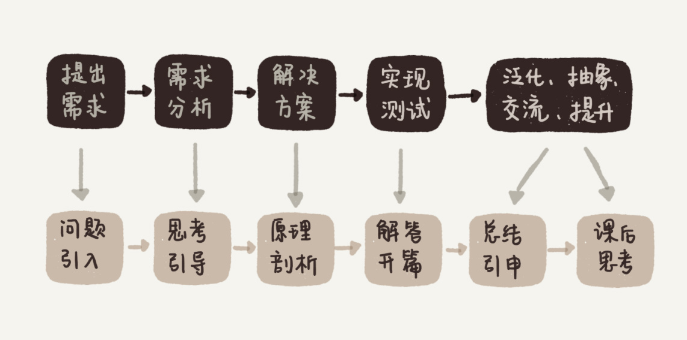
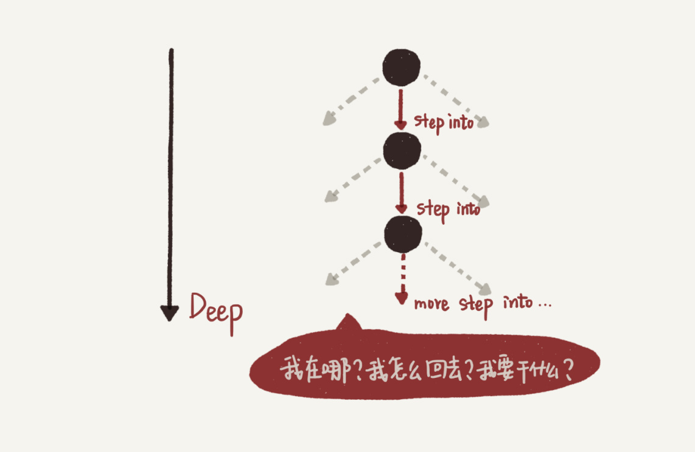

# 用户故事 | zixuan：站在思维的高处，才有足够的视野和能力欣赏“美”
<audio src='./用户故事-zixuan：站在思维的高处，才有足够的视野和能力欣赏“美”.mp3' controls></audio>
大家好，我是zixuan，在一家国内大型互联网公司做后端开发，坐标深圳，工作5年多了。今天和大家分享一下，我学习专栏的一些心得体会。

随着年龄的增长，我经历了不少业务、技术平台、中间件等多种环境和编程工具的迭代变更。与此同时，我越来越意识到，要做一名优秀的程序员，或者说，能够抵御年龄增长并且增值的程序员，有两样内功是必须持续积累的，那就是 **软件工程经验方法** 和 **算法应用能力**。

通俗地讲，就是不论在什么系统或业务环境下、用什么编程工具，都能写出高质量、可维护、接口化代码的能力，以及分解并给出一个实际问题有效解决方案的能力。

## 我为什么会订阅这个专栏？

这也是为什么我在极客时间上看到王争老师的“数据结构与算法之美”的开篇词之后，果断地加入学习行列。同时，我也抱有以下两点期望。

第一，这个专栏是从工程应用，也就是解决实际问题的角度出发来讲算法的，原理和实践相辅相成，现学现用，并且重视思考过程。从我个人经验来看，这的确是比较科学的学习方法。我相信很多人和我一样，以前在学校里都学过算法，不过一旦不碰书了，又没有了应用场景后，很快就把学过的东西丢了，重新拾起来非常困难。

第二，从专栏的标题看出，王争老师试图带我们感受算法的“美”，那必将要先引导我们站在思维的高处，这样才有足够的视野和能力去欣赏这种“美”。我很好奇他会怎么做，也好奇我能否真正地改变以前的认知，切身地感受到“美”。

## 我是如何学习这个专栏的？

就这样，同时带着笃定和疑问，我上路了。经过几个月的认真学习，“数据结构与算法之美”成了我在极客时间打开次数最多，花费时间最多，完成度也最高的一门课。 **尽管如此，我觉得今后我很可能还会再二刷、多刷这门课，把它作为一个深入学习的索引入口。** 接下来，我就从几个方面，跟你分享下，这半年我学习这个专栏的一些感受和收获。

### 1.原理和实用并重：从实践中总结，应用到实践中去

学习的最终目的是为了解决实际问题，专栏里讲的很多方法甚至代码，都能够直接应用到大型项目中去，而不仅仅是简单的原理示例。

比如王争老师在讲散列表的时候，讲了实现一个工业级强度的散列表有哪些需要注意的点。基本上面面俱到，我在很多标准库里都找到了印证。再比如，老师讲的LRU Cache、Bloom Filter、范围索引上的二分查找等等，也基本和我之前阅读LevelDB源代码时，看到的实现细节如出一辙，无非是编程语言的差别。

所以，看这几部分的时候，我觉得十分惊喜，因为我经历过相关的实际应用场景。反过来，专栏这种原理和实用并重的风格，也能帮助我今后在阅读开源代码时提升效率、增进理解。

另外，我觉察到，文章的组织结构，应该也是老师试图传达给我们的“他自己的学习方法”：从开篇介绍一个经典的实际问题开始（需求），到一步步思考引导（分析），再到正式引出相关的数据结构和算法（有效解决方案），再将其应用于开篇问题的解决（实现、测试），最后提出一个课后思考题（泛化、抽象、交流、提升）。

这个形式其实和解决实际工程问题的过程非常类似。我想，大部分工程师就是在一个个这样的过程中不断积累和提升自己的，所以我觉得这个专栏，不论是内容还是形式真的都很赞。

### 2\. 学习新知识的角度：体系、全面、严谨、精炼，可视化配图易于理解

“全面”并不是指所有细节面面俱到。事实上，由于算法这门学科本身庞大的体量，这类专栏一般只能看作一个丰富的综述目录，或者深入学习的入口。尽管如此，王争老师依然用简洁精炼的语言Cover到了几乎所有最主要的数据结构和算法，以及它们背后的本质思想、原理和应用场景，知识体系结构全面完整并自成一体。

我发现只要能紧跟老师的思路，把每一节的内容理解透彻，到了语言实现部分，往往变成了一种自然的总结描述，所以代码本身并不是重点，重点是背后的思路。

例如，KMP单模式串匹配和AC自动机多模式串匹配算法是我的知识盲区。以前读过几次KMP的代码，都没完全搞懂，于是就放弃了。至于AC自动机，惭愧地说，我压根儿就没怎么听说过。

但是，在专栏里，王争老师从BruteForce方法讲起，经过系统的优化思路铺垫，通俗的举例，再结合恰到好处的配图，最后给出精简的代码。我跟随着老师一路坚持下来，当我看到第二遍时突然就豁然开朗了。而当我真正理解了AC自动机的构建和工作原理之后，在某一瞬间，我的内心的确生出了一种美的感觉（或者更多的是“妙”吧？）。

AC自动机构建的代码，让我不自觉地想到“编织”这个词。之前还觉得凌乱的、四处喷洒的指针，在这里一下子变成了一张有意义的网，编织的过程和成品都体现出了算法的巧妙。这类联想无疑加深了我对这类算法的理解，也许这也意味着，我可以把它正式加入到自己的算法工具箱里了。

另外一个例子是动态规划。以前应用DP的时候，我常常比较盲目，不知道怎么确定状态的表示，甚至需要几维的状态都不清楚，可以说是在瞎猜碰运气。经过老师从原理到实例的系统讲解后，我现在明白，原来DP本质上就是在压缩重复子问题，状态的定义可以通过最直接的回溯搜索来启发确定。明白这些之后，动态规划也被我轻松拿下了。

### 3\. 已有知识加深的角度：促进思考，连点成线

之前看目录的时候，我发现专栏里包含了不少我已经知道的知识。但真正学习了之后，我发现，以前头脑中的不少概念知识点，是相对独立存在的，基本上一个点就对应固定的那几个场景，而在专栏里，王争老师比较注重概念之间的相互关联。对于这些知识，经过王争老师的讲解，基本可以达到交叉强化理解，甚至温故知新的效果。

比如老师会问你，在链表上怎么做二分查找？哈希和链表为什么经常在一起出现？这些问题我之前很少会考虑到，但是当我看到的时候，却启发出很多新的要点和场景（比如SkipList、LRUCache）。

更重要的是，跟着专栏学习一段时间之后，我脑中原本的一些旧概念，也开始自发地建立起新的连接，连点成线，最后产生了一些我之前从未注意到的想法。

举个感触最深的例子。在跟随专栏做了大量递归状态跟进推演，以及递归树分析后，我现在深刻地认识到，递归这种编程技巧背后，其实是树和堆栈这两种看似关联不大的数据结构。为什么这么说呢？

堆栈和树在某个层面上，其实有着强烈的对应关系。我刚接触递归的时候，和大多数初学者一样，脑子很容易跟着机器执行的顺序往深里绕，就像Debug一个很深的函数调用链一样，每遇到一个函数就step into，也就是递归函数展开->下一层->递归函数展开->下一层->…，结果就是只有“递”，没有“归”，大脑连一次完整调用的一半都跑不完（或者跑完一次很辛苦），自然就会觉得无法分析。如下图，每个圈代表在某一层执行的递归函数，向下的箭头代表调用并进入下一层。

我初学递归时遇到的问题：有去无回，陷得太深

随着我处理了越来越多的递归，我慢慢意识到，为什么人的思考一定要follow机器的执行呢？在递归函数体中，我完全可以不用每遇到递归调用都展开并进入下一层（step into），而是可以直接假定下一层调用能够正确返回，然后我该干嘛就继续干嘛（step over），这样的话，我只需要保证最深一层的逻辑，也就是递归的终止条件正确即可。

原因也很简单，不管在哪一层，都是在执行递归函数这同一份代码，不同的层只有一些状态数据不同而已，所以我只需要保证递归函数代码逻辑的正确性，就确保了运行时任意一层的结果正确性。像这样说服自己可以随时step over后，我的大脑终于有“递”也有“归”了，后续事务也就能够推动了。

有一定经验后我如何思考递归：有去有回，自由把握

最近在学习这门课程的过程中，我进一步认识到，其实上面两个理解递归的方式，分别对应递归树的深度遍历和广度遍历。尽管机器只能按照深度优先的方式执行递归代码，但人写递归代码的时候更适合用广度的思考方式。当我在实现一个递归函数的时候，其实就是在确定这棵树的整体形状：什么时候终止，什么条件下生出子树，也就是说我实际上是在编程实现一棵树。

那递归树和堆栈又有什么关系呢？递归树中从根节点到树中任意节点的路径，都对应着某个时刻的函数调用链组成的堆栈。递归越深的节点越靠近栈顶，也越早返回。因而我们可以说，递归的背后是一棵树，递归的执行过程，就是在这棵树上做深度遍历的过程，每次进入下一层（“递”）就是压栈，每次退出当前层（“归”）就是出栈。所有的入栈、出栈形成的脉络就组成了递归树的形态。递归树是静态逻辑背景，而当前活跃堆栈是当前动态运行前景。

学完专栏后我怎么看待递归：胸有成“树”，化动为静

这样理解之后，编写或阅读递归代码的时候，我真的能够站得更高，看得更全面，也更不容易掉入一些细节陷阱里去了。

说到这里，我想起之前在不同时间做过的两道题，一道是计算某个长度为n的入栈序列可以有多少种出栈序列，另一道是计算包含n个节点的二叉树有多少种形状。我惊讶地发现，这两个量竟然是相等的（其实就是卡特兰数）。当时我并不理解为什么栈和树会存在这种关联，现在通过类似递归树的思路我觉得我能够理解了，那就是每种二叉树形状的中序遍历都能够对应上一种出栈顺序。

类似这样“旧知识新理解”还有很多，尽管专栏里并没有直接提到，但是这都是我跟随专栏，坚持边学边思考，逐步感受和收获的。

## 总结

基于以上谈的几点收获和感受，我再总结下我认为比较有用的、学习这个专栏的方法。

**1.紧跟老师思路走，尽量理解每一句话、每一幅配图，亲手推演每一个例子。**

王争老师语言精炼。有些文字段落虽短，但背后的信息量却很大。为了方便我们理解，老师用了大量的例子和配图来讲解。即便是非常复杂、枯燥的理论知识，我们理解起来也不会太吃力。

当然有些地方确实有点儿难，这时我们可以退而求其次，“先保接口，再求实现”。例如，红黑树保持平衡的具体策略实现，我跟不下来，就暂时跳过去了，但是我只要知道，它是一种动态数据的高效平衡树，就不妨碍我先使用这个工具，之后再慢慢理解。

**2.在学的过程中回顾和刷新老知识点，并往工程实践上靠。学以致用是最高效的方法**。

**3.多思考，思考比结果重要；多交流，亲身感受和其他同学一起交流帮助很大。**

最后，感谢王争老师和极客时间，让我在这个专栏里有了不少新收获。祝王争老师事业蒸蒸日上，继续开创新品，也希望极客时间能够联合更多的大牛老师，开发出更多严谨又实用的精品课程！